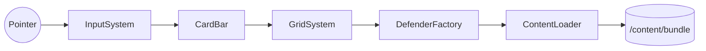

# Технический план: [Название фичи]

**ID фичи:** NNN-slug
**Статус:** Draft | In Review | Approved | Implemented
**Связанная спека:** [`spec.md`](spec.md)

> Здесь — **как** реализуем требования из `spec.md`. Конкретные файлы, классы, схемы, API.

---

## 1. Технический контекст

- **Фронтенд:** Phaser 3 + TS + Vite (`apps/web`).
- **Бэкенд:** Fastify + TS + Prisma (`apps/api`).
- **Shared:** Zod-схемы и DTO (`packages/shared`).
- **БД:** Postgres.
- **Контент:** `content/**/*.json`.

Особые зависимости этой фичи: [перечислить].

## 2. Проверка соответствия Конституции (Constitution Check)

Прогон каждого из 12 принципов.

| # | Принцип | Соблюдаем? | Как именно |
|---|---------|------------|------------|
| 1 | Spec-first | Да | Есть `spec.md` |
| 2 | pnpm-monorepo | Да | Изменения в `apps/web`, `apps/api`, `packages/shared` |
| 3 | Data-driven | Да | Новый защитник — JSON в `content/defenders/` |
| 4 | Shared-first | Да | Типы в `packages/shared/src/content/defender.ts` |
| 5 | Universal input | Да | Phaser Pointer Events |
| 6 | Deploy-first | Да | CI прогоняется |
| 7 | Playable demo | Да | См. `spec.md → Demo` |
| 8 | Guest-first | — / Да | Фича не требует логина |
| 9 | AI-ассеты | Да | Промпты ниже в разделе «Ассеты» |
| 10 | Testable AC | Да | В `spec.md § 5` |
| 11 | One feature = one branch | Да | `feature/NNN-slug` |
| 12 | Баланс в контенте | Да | HP, урон, кулдауны — в JSON |

> Нарушение любого принципа — **стоп**. Либо меняем план, либо поправкой правим конституцию.

## 3. Архитектурное решение

Короткая диаграмма или список компонентов, которые затрагиваются.



## 4. Затрагиваемые файлы и изменения

Список новых и изменяемых файлов с одной строкой описания.

### Новые файлы

- `apps/web/src/systems/InputSystem.ts` — обработчик drag-and-drop.
- `apps/web/src/ui/CardBar.ts` — компонент верхней панели карт.
- `content/defenders/sun.json` — новый защитник.
- `content/images/sun-idle.png` — спрайт, генерируется (см. §7).

### Изменяемые файлы

- `apps/web/src/scenes/GameScene.ts` — подключить `CardBar`.
- `packages/shared/src/content/defender.ts` — добавить поле `behavior.kind = 'generator'`.

## 5. Data Model

Если фича меняет БД:

- Новая модель Prisma:
  ```prisma
  model SaveSlot {
    id        String   @id @default(cuid())
    userId    String
    level     Int      @default(1)
    stars     Int      @default(0)
    shards    Int      @default(0)
    updatedAt DateTime @updatedAt
  }
  ```
- Миграция: `pnpm --filter api prisma migrate dev -n add_save_slot`.

Если фича не меняет БД — напишите «не применимо».

## 6. API-контракты

Для каждого нового/изменённого эндпоинта:

- **`POST /auth/guest`**
  - Request: `{}`
  - Response: `GuestUserDto` (определён в `packages/shared/src/dto/auth.ts`)
  - Побочные эффекты: устанавливает httpOnly cookie `sb_token`.

Если фича чисто клиентская — «не применимо».

## 7. Контент и ассеты

Список добавляемых JSON-файлов с кратким содержимым и список ассетов с промптами генерации.

- `content/defenders/sun.json` — поведение `generator`, `amount: 25`, `intervalMs: 7000`.
- Ассет `sun-idle.png` (512×512, прозрачный фон):
  > «kawaii sun with happy face, neon glow, Solar Balls style, cartoon, transparent background, 512x512 PNG».

## 8. Quickstart (ручная проверка)

Пошагово, как проверить фичу локально: см. [`quickstart.md`](quickstart.md).

## 9. Риски и откат

- **Риск:** Pointer Events ведут себя иначе на Safari iOS < 15.
  - **Митигация:** проверить на симуляторе, при необходимости добавить polyfill.
- **План отката:** `git revert` одного коммита; фича изолирована в `feature/NNN-slug`.

## 10. Последующие фазы

- `tasks.md` — список задач.
- `research.md` — если было исследование альтернатив.
