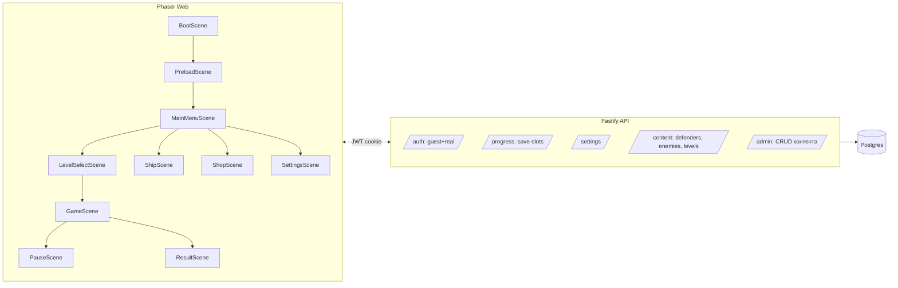

# Solar Balls PvZ — мастер-план

> Это копия оригинального плана из чата (расширенная версия с pnpm-монорепо, бэкендом, авторизацией, контент-системой и деплоем с этапа 0).
> Оригинал хранится в `.cursor/plans/` и доступен только в Cursor. Эта копия — часть репозитория и служит источником истины для `specs/` в Spec-Driven Development-флоу.

---

## 1. Стек и принципы

- **Пакетный менеджер:** `pnpm` (с `workspaces`), монорепо.
- **Фронтенд:** Phaser 3 + TypeScript + Vite (HMR, быстрые AI-итерации).
- **Бэкенд:** Node.js (LTS) + Fastify + TypeScript + Prisma ORM.
- **БД:** PostgreSQL 16 (в проде), локалка — через Docker Compose.
- **Auth:** JWT access/refresh-токены в httpOnly cookie; дефолтный **guest-пользователь** создаётся автоматически при первом заходе (устройство → guestId).
- **Shared:** `packages/shared` — Zod-схемы контента (defenders/enemies/levels) и DTO API, переиспользуются фронтом и бэком.
- **Контент:** все защитники/враги/уровни — JSON-файлы в `content/` с валидацией Zod-схемой; хот-релоад в деве; админ-панель на этапе 12.
- **Ввод:** Phaser Pointer Events (`pointerdown/pointermove/pointerup`) — одинаково работает для мыши, тача и стилуса.
- **Разрешение:** виртуальное 1280×720, `Scale.FIT`; мобильная ландшафтная вёрстка.
- **Деплой:** Docker-образы `web` и `api`, одна команда `pnpm deploy:prod`. Рекомендую Fly.io или Railway (бесплатный тир + Postgres одной кнопкой). Фронт отдельно на Vercel/Netlify, API на Fly.io. CDN и HTTPS — из коробки.
- **AI-итерации:** каждый этап = один PR с ограниченным функционалом и работающим демо; генерация недостающих картинок — часть этапа.

## 2. Структура монорепо

```
ben-pvz/
├── pnpm-workspace.yaml
├── package.json                 # корневые скрипты: dev, build, deploy
├── docker-compose.yml           # postgres + api + web (dev)
├── .env.example
├── apps/
│   ├── web/                     # Phaser клиент
│   │   ├── index.html
│   │   ├── vite.config.ts
│   │   ├── Dockerfile           # nginx static build
│   │   └── src/
│   │       ├── main.ts
│   │       ├── scenes/
│   │       ├── entities/
│   │       ├── systems/
│   │       ├── ui/
│   │       ├── config/
│   │       └── i18n/
│   └── api/                     # Fastify сервер
│       ├── Dockerfile
│       ├── prisma/
│       │   ├── schema.prisma
│       │   └── migrations/
│       └── src/
│           ├── server.ts
│           ├── routes/
│           ├── plugins/
│           ├── services/
│           └── schemas/
├── packages/
│   └── shared/
│       ├── src/
│       │   ├── content/
│       │   ├── dto/
│       │   └── events/
│       └── package.json
└── content/
    ├── defenders/*.json
    ├── enemies/*.json
    ├── levels/*.json
    └── images/
```

## 3. Архитектура (высокий уровень)



## 4. Контент-система

Каждая сущность (защитник, враг, уровень) — JSON-файл, валидируется Zod-схемой из `packages/shared`.

### 4.1 Схема защитника

```ts
import { z } from 'zod';

export const defenderSchema = z.object({
  id: z.string(),
  name: z.record(z.string(), z.string()),
  cost: z.number().int().positive(),
  hp: z.number().int().positive(),
  sprite: z.string(),
  behavior: z.discriminatedUnion('kind', [
    z.object({ kind: z.literal('generator'), resource: z.literal('energy'), amount: z.number(), intervalMs: z.number() }),
    z.object({ kind: z.literal('shooter'), damage: z.number(), cooldownMs: z.number(), projectileSpeed: z.number() }),
    z.object({ kind: z.literal('area'), damage: z.number(), radiusCells: z.number(), cooldownMs: z.number() }),
    z.object({ kind: z.literal('wall') }),
  ]),
  unlockLevel: z.number().int().nonnegative().default(0),
  shopPrice: z.number().int().nonnegative().optional(),
});
```

### 4.2 Схема уровня

```ts
export const levelSchema = z.object({
  id: z.string(),
  name: z.record(z.string(), z.string()),
  background: z.string(),
  startEnergy: z.number().int(),
  availableDefenders: z.array(z.string()),
  waves: z.array(z.object({
    delayMs: z.number(),
    spawns: z.array(z.object({ enemyId: z.string(), row: z.number().int(), count: z.number().int(), intervalMs: z.number() })),
  })),
  rewards: z.object({ shards: z.number().int(), firstClearBonus: z.number().int() }),
});
```

### 4.3 Загрузка

- **Dev:** `ContentLoader` на фронте делает `GET /content/bundle` → API читает `content/*.json`, валидирует, отдаёт объединённый JSON. Живое редактирование — хот-релоад через Vite + SSE от API.
- **Prod:** контент собирается в статический `content.bundle.json` в `apps/web/public/` при билде; API возвращает версию из БД, если она изменена через админку.

## 5. Генерация недостающих ассетов

1. Сначала используем существующие файлы из [../assets/](../assets/).
2. Если чего-то не хватает — генерируем AI по промпту в едином стиле: «cartoonish neon space, vivid purples/cyans/magenta, rounded shapes, kawaii faces, Solar Balls style, transparent background 512×512 PNG».
3. Сохраняем в `content/images/`, прогоняем через `pngquant`/`sharp` до ≤ 200 КБ (`pnpm assets:optimize`).
4. Большие референсы (`ScYXV6KJ.png` 7 МБ) пересжимаем до ≤ 500 КБ.

## 6. Универсальный Drag-and-Drop

Phaser 3 Pointer Events через `this.input.setDraggable(obj)` + `dragstart/drag/dragend/dragenter/dragleave/drop`. Единый API для мыши, тача и стилуса. Реализуется один раз в `systems/InputSystem.ts`:

- Источник: карта в `CardBar`.
- Цель: клетка `GridSystem`.
- Подсветка клетки под pointer.
- Условия дропа: клетка пуста, энергии хватает, карта не на кулдауне.
- Мобилка: увеличенный hitbox (≥ 64 px), `this.input.addPointer(2)` в `BootScene`.

---

## Этап 0 — Монорепо и деплой-каркас

**Демо:** пустой холст доступен по URL.
- `pnpm init` + `pnpm-workspace.yaml` с `apps/*`, `packages/*`.
- `apps/web`: Phaser 3 + TS + Vite, `BootScene` → `PreloadScene` → `MainMenuScene` с текстом.
- `apps/api`: Fastify + TS, роут `GET /health`.
- `packages/shared`: пустой, tsconfig.
- `docker-compose.yml`: postgres + api + web.
- Dockerfile для web (nginx) и api (node:lts-slim).
- Скрипты: `pnpm dev`, `pnpm build`, `pnpm deploy:prod`.
- GitHub Actions (опц.): push в `main` → сборка и деплой.
- README с инструкцией.

**Ассеты:** копируем `assets/*` в `apps/web/public/assets/`.

---

## Этап 1 — Главное меню + workflow ассетов

**Демо:** навигация и визуальный стиль.
- Компонент `NeonButton`.
- 5 кнопок: ИГРАТЬ, КОРАБЛЬ АСТРОЧЕЛА, МАГАЗИН АСТРОЧЕЛА, НАСТРОЙКИ, ВЫХОД.
- Навигация по сценам-заглушкам с «Назад».
- `i18n/ru.json`, `i18n/en.json`.

**Ассеты:** `menu-bg.png`, `btn-neon-blue.png`, `btn-neon-pink.png`, `astrochel-thumbsup.png`.

---

## Этап 2 — Поле 5×9 и универсальный drag-and-drop

**Демо:** перетаскивание работает на мобиле и десктопе.
- `GridSystem` — конверсия пиксели↔клетки, подсветка.
- Фон поля (пересжатый референс).
- `InputSystem` — единый drag-and-drop через `setDraggable`.
- Палитра слева с одной картой Земли, снап/возврат.
- Счётчик энергии (заглушка 50).

**Ассеты:** `earth-card.png`, `cell-highlight.png`.

---

## Этап 3 — Контент-схема и два защитника

**Демо:** стрельба по данным из JSON.
- Zod-схемы в `packages/shared`.
- `content/defenders/sun.json`, `content/defenders/earth-shooter.json`.
- `ContentLoader` → валидация → `DefenderFactory.create(id, cell)`.
- Поведения: generator, shooter.
- `Projectile`, `EnergySystem`, кликабельные `EnergyOrb`.

**Ассеты:** `sun-idle.png`, `earth-shooter-idle.png`, `energy-orb.png`, `projectile-basic.png`.

---

## Этап 4 — Враги, волны, победа/поражение

**Демо:** полный цикл боя.
- `content/enemies/meteor.json`.
- `WaveSpawner` с жёстко зашитой волной.
- Коллизии: снаряд→враг, враг→защитник, враг-за-границей → поражение.
- `ResultScene` (победа/поражение).

**Ассеты:** `meteor-idle.png`.

---

## Этап 5 — Меню паузы и HUD

**Демо:** управление боем.
- Кнопка паузы (top-right).
- `PauseScene` overlay.
- Три кнопки: Продолить (синий), Выйти в меню (оранжевый), Рестарт (зелёный).
- HUD: энергия, прогресс-бар волны, номер уровня.

**Ассеты:** `pause-shield.png`, `btn-continue.png`, `btn-menu.png`, `btn-restart.png`, `icon-pause.png`.

---

## Этап 6 — Карт-бар и 5–6 защитников

**Демо:** стратегический бой + мобильная раскладка.
- `CardBar` с 8 слотами, кулдауны визуальной заливкой.
- JSON: `sun`, `earth-shooter`, `mercury-fast`, `venus-area`, `mars-heavy`, `jupiter-wall`.
- Экран «выбор колоды» перед боем.
- Мобильная раскладка: предупреждение про ландшафт, hitbox ≥ 64 px.

**Ассеты:** `<id>-idle.png`, `<id>-card.png` + рамки карточек.

---

## Этап 7 — Бэкенд, Postgres, гостевой пользователь

**Демо:** прогресс синхронится между устройствами.
- Prisma schema: `User`, `GuestUser`, `SaveSlot`, `Setting`, `ProgressEvent`.
- `@fastify/jwt` + cookie, middleware `ensureUser` (авто-гость).
- Роуты: `POST /auth/guest`, `GET/PUT /progress`, `GET/PUT /settings`, `GET /content/bundle`.
- `ApiClient` + `SaveSystem` теперь через API + fallback localStorage.
- UI-бейдж «Гость».

**Ассеты:** `guest-avatar.png`.

---

## Этап 8 — Разнообразие врагов через JSON

**Демо:** насыщенный уровень.
- 4–5 JSON: `meteor`, `comet`, `ufo-3f3f3f`, `asteroid-tank`, `blackhole-mini`.
- Новые `behavior.kind`: walker, flyer, tank, puller.
- Волны с `delayMs`, группами спавна, прогресс-бар с флагами.

**Ассеты:** `comet-idle.png`, `ufo-idle.png`, `asteroid-tank.png`, `blackhole-mini.png`.

---

## Этап 9 — Выбор уровня, 5–10 уровней

**Демо:** кампания.
- `content/levels/01.json` … `10.json`.
- `LevelSelectScene` — карта галактики.
- Прогресс через `PUT /progress`: последний уровень, звёзды.
- Пост-бой: экран наград.

**Ассеты:** `galaxy-map-bg.png`, `level-node-locked.png`, `level-node-open.png`, `level-node-stars.png`, 2–3 фона поля.

---

## Этап 10 — Настройки, экономика, магазин

**Демо:** прокачка через покупки.
- `SettingsScene` с sync через `PUT /settings`.
- Валюта «звёздные осколки» + `/economy/earn`, `/economy/spend`.
- `ShopScene` из `content/shop.json`: защитники, скины, усиления.
- 3 слота сохранений.

**Ассеты:** `shop-bg.png`, рамки товаров.

---

## Этап 11 — Корабль Астрочела и метапрогрессия

**Демо:** модификаторы боя.
- `ShipScene`: Коллекция / Прокачка / Дневник.
- Upgrades в `SaveSlot`, возвращаются в `GET /progress`.
- `GameScene` применяет модификаторы.

**Ассеты:** `ship-interior-bg.png`, иконки комнат, портрет Астрочела.

---

## Этап 12 — Админ-панель: визуальный редактор контента

**Демо:** создание защитника и уровня без кода.
- Роутер `/admin` (роль `admin`).
- Визуальный редактор JSON по Zod-схеме: формы, конструктор волн (сетка × тайм-лайн).
- Кнопка «Сгенерировать иллюстрацию» → image API (DALL·E / SD / Fal.ai).
- `pnpm content:sync` сохраняет БД → файлы для git.

**Ассеты:** UI-иконки редактора.

---

## Этап 13 — Реальная авторизация + полировка

- **13a — Auth:** регистрация email+password (bcrypt), OAuth. Merge гостевого прогресса в аккаунт.
- **13b — Боссы:** `blackhole-boss.json`, `eris-queen.json` с фазами.
- **13c — Мини-игры:** сбор осколков, защита корабля.
- **13d — Достижения:** `content/achievements/*.json` + `EventBus`.
- **13e — Аудио:** музыка, SFX.
- **13f — Анимации:** spritesheet `idle/attack/hurt/die`, частицы, переходы.
- **13g — Прод-деплой:** домен, HTTPS, бэкапы, Sentry.

**Ассеты:** spritesheets, иконки достижений, `*.ogg`, OAuth-кнопки.

---

## 7. Рекомендации по AI-итерациям

- **Один этап = один PR.** В начале этапа: «план в `docs/plans/solar-balls-plan.md`, работаем над этапом N».
- **Сначала схема, потом данные, потом UI.** Zod-схема → JSON → код.
- **Генерацию картинок вшивайте в этап.** Если ассета нет — создайте в том же PR.
- **Проверяйте мобилку с этапа 2.**
- **Версионируйте контент.** `content/` под git.
- **Префетч бандла.** `GET /content/bundle` один раз при старте.
- **Ограничивайте размер PNG.**
- **Бэкап БД** с этапа 7.
