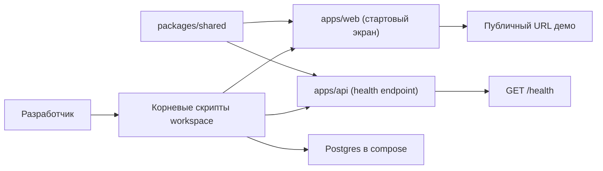

# Технический план: Монорепо и деплой-каркас

**ID фичи:** 001-monorepo-and-deploy
**Статус:** Approved
**Связанная спека:** [`spec.md`](spec.md)

> Здесь — **как** реализуем требования из `spec.md`. Конкретные файлы, классы, схемы, API.

---

## 1. Технический контекст

- **Фронтенд:** Phaser 3 + TypeScript + Vite (`apps/web`).
- **Бэкенд:** Fastify + TypeScript + Prisma (`apps/api`).
- **Shared:** Zod-схемы и DTO (`packages/shared`).
- **БД:** PostgreSQL 16 в локальном контуре через Docker Compose.
- **Контент:** `content/**/*.json` как единый формат данных проекта (в этом этапе — без расширения схем).

Особые зависимости этой фичи:
- Базовые контейнерные образы для клиентской и серверной частей.
- Единые корневые скрипты для локального запуска, сборки и прод-публикации.
- Минимальный endpoint мониторинга для серверной части (`GET /health`).

## 2. Проверка соответствия Конституции (Constitution Check)

| # | Принцип | Соблюдаем? | Как именно |
|---|---------|------------|------------|
| 1 | Spec-first | Да | Есть `spec.md`, текущий `plan.md`, далее будет `tasks.md` |
| 2 | pnpm-монорепо | Да | Структура строго в `apps/*`, `packages/*`, запуск и скрипты через `pnpm` |
| 3 | Data-driven контент | Да | На этапе 0 контент-логика не расширяется и не уходит в хардкод |
| 4 | Shared-first типы | Да | Общие типы и DTO закладываются в `packages/shared` |
| 5 | Universal input | Да | Функционал ввода в этой фиче отсутствует, принцип не нарушается |
| 6 | Deploy-first | Да | Публичный URL демо и рабочий `deploy:prod` входят в scope этапа |
| 7 | Playable demo | Да | Демо с открываемым стартовым экраном определено в `spec.md` |
| 8 | Guest-first авторизация | Да | Демо доступно без регистрации; полноценный guest lifecycle остаётся этапу 7 |
| 9 | AI-ассеты в едином стиле | Да | На этапе 0 используются имеющиеся ассеты; генерация нужна только при нехватке |
| 10 | Testable AC | Да | Проверяемые AC зафиксированы в `spec.md`, quickstart покрывает ручную проверку |
| 11 | One feature = one branch | Да | План рассчитан на одну ветку `feature/001-monorepo-and-deploy` |
| 12 | Константы/баланс | Да | Баланс и геймплейные числа этим этапом не вводятся |

## 3. Архитектурное решение

Этап формирует минимальный вертикальный срез: клиентская точка входа, сервер с health-check, общее пространство типов и единый локальный/публичный запуск.

## 4. Затрагиваемые файлы и изменения

### Новые файлы

- `pnpm-workspace.yaml` — описание workspace-пакетов.
- `package.json` (корень) — скрипты `dev`, `build`, `deploy:prod`.
- `.env.example` — документированный набор переменных окружения.
- `docker-compose.yml` — локальный контур `postgres + api + web`.
- `apps/web/index.html` — точка входа клиента.
- `apps/web/vite.config.ts` — конфигурация клиента для разработки/сборки.
- `apps/web/src/main.ts` — старт приложения и запуск стартовой сцены.
- `apps/web/src/scenes/BootScene.ts` — подготовка и переход к сцене отображения.
- `apps/web/src/scenes/PreloadScene.ts` — предзагрузка базовых ресурсов.
- `apps/web/src/scenes/MainMenuScene.ts` — пустой холст с текстом «Шаранутые игры».
- `apps/web/Dockerfile` — контейнеризация статической клиентской сборки.
- `apps/api/src/server.ts` — инициализация API-сервера.
- `apps/api/src/routes/health.ts` — endpoint `GET /health`.
- `apps/api/Dockerfile` — контейнеризация серверного приложения.
- `packages/shared/package.json` — базовая конфигурация общего пакета.
- `packages/shared/tsconfig.json` — базовые настройки компиляции shared-пакета.
- `specs/001-monorepo-and-deploy/contracts/health.ts` — контракт запроса/ответа health endpoint.

### Изменяемые файлы

- `README.md` — инструкция «как запустить локально», «как проверить health», «как открыть публичное демо».

## 5. Data Model

Не применимо для этапа 0: изменения Prisma-моделей и контент-схем (Zod) не требуются.

## 6. API-контракты

- **`GET /health`**
  - Request: без тела запроса.
  - Response: JSON со статусом сервиса (минимум поле `status` со значением `ok`).
  - Контракт хранится в: `specs/001-monorepo-and-deploy/contracts/health.ts`.
  - Назначение: быстрая проверка доступности API в локальной и публичной среде.

## 7. Контент и ассеты

- **JSON-контент:** в этом этапе не добавляются новые игровые JSON-сущности.
- **Ассеты:** базовые изображения копируются из `assets/*` в публичные ассеты клиента.
- **AI-генерация:** не требуется, если существующего набора ассетов достаточно для демо этапа 0.
- **Если ассет окажется отсутствующим:** генерировать по промпту конституции  
  `cartoonish neon space, vivid purples/cyans/magenta, rounded shapes, kawaii faces, Solar Balls style, transparent background 512x512 PNG`.

## 8. Quickstart (ручная проверка)

Пошаговая ручная проверка описана в [`quickstart.md`](quickstart.md).

## 9. Риски и откат

- **Риск:** расхождение локального и публичного окружений (доступно локально, но не открывается URL).
  - **Митигация:** одинаковые переменные окружения для обоих контуров + обязательная проверка health endpoint после деплоя.
- **Риск:** неполная документация приводит к ошибкам онбординга.
  - **Митигация:** quickstart и README синхронизируются в рамках этой же фичи.
- **Риск:** избыточное расширение scope (добавление меню/геймплея раньше этапа 1+).
  - **Митигация:** жёсткая граница out-of-scope из `spec.md`.
- **План отката:** откатить один фича-коммит/PR целиком, возвращая проект к состоянию до каркаса, без затрагивания последующих игровых этапов.

## 10. Последующие фазы

- Сформировать `tasks.md` по этому плану.
- После выполнения задач обновить статус артефактов и проверить соответствие AC из `spec.md`.
