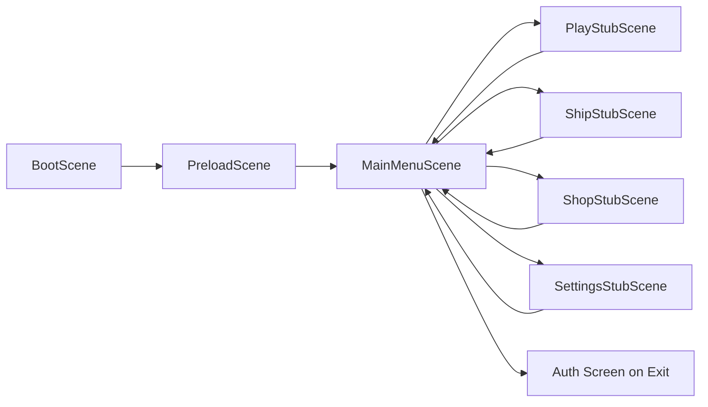

# Технический план: Главное меню и workflow ассетов

**ID фичи:** 002-main-menu-assets
**Статус:** Approved
**Связанная спека:** [`spec.md`](spec.md)

> Здесь — **как** реализуем требования из `spec.md`. Конкретные файлы, сцены, ассеты, i18n и навигация.

---

## 1. Технический контекст

- **Фронтенд:** Phaser 3 + TypeScript + Vite (`apps/web`).
- **Бэкенд:** Fastify + TypeScript + Prisma (`apps/api`) — в этой фиче не изменяется.
- **Shared:** `packages/shared` — в этой фиче не изменяется.
- **БД:** Postgres — не затрагивается.
- **Контент/ассеты:** базовые меню-ассеты + словари локализации.

Особые зависимости этой фичи:
- Переиспользуем текущий загрузочный пайплайн сцен (`boot` -> `preload` -> `main-menu`).
- Добавляем клиентскую навигацию между сценами-заглушками без серверных вызовов.
- Фиксируем поведение `ВЫХОД`: переход на экран авторизации и завершение текущей гостевой сессии через уже существующую логику выхода (если доступна), иначе graceful fallback на редирект.

## 2. Проверка соответствия Конституции (Constitution Check)

| # | Принцип | Соблюдаем? | Как именно |
|---|---------|------------|------------|
| 1 | Spec-first | Да | Есть `spec.md`; текущий документ создаёт слой `plan.md` до реализации |
| 2 | pnpm-монорепо | Да | Изменения только внутри `apps/web` и `specs/002-main-menu-assets` |
| 3 | Data-driven контент | Да | Фича не вводит боевой/балансный контент; текстовые данные вынесены в JSON-словари локализации |
| 4 | Shared-first типы | Да | Нет новых типов на границе клиент-сервер/контент |
| 5 | Universal input | Да | Кнопки меню и возврат обрабатываются единым pointer-вводом |
| 6 | Deploy-first | Да | Результат — публично проверяемое демо без локальных-only шагов |
| 7 | Playable demo | Да | Демо включает полную навигацию по меню и сценам-заглушкам |
| 8 | Guest-first auth | Да | Гость не блокируется; `ВЫХОД` завершает сессию и ведёт на авторизацию |
| 9 | AI-ассеты в едином стиле | Да | Для недостающих ассетов заданы единые AI-промпты и лимиты размера |
| 10 | Testable AC | Да | Проверка строится напрямую по AC из `spec.md` |
| 11 | One feature = one branch | Да | План рассчитан на отдельную ветку `feature/002-main-menu-assets` |
| 12 | Константы/баланс | Да | Баланс не затрагивается; технические константы не меняются |

## 3. Архитектурное решение

Решение добавляет слой UI-компонентов меню поверх текущей цепочки сцен и создаёт 4 сцены-заглушки для навигации.

Ключевые элементы:
- Базовый `NeonButton` как переиспользуемый UI-примитив (варианты кнопок: primary/secondary).
- Сервис локализации для ru/en с ключами меню и заглушек.
- Единая сцена-заглушка (с параметрами) или четыре тонких сцены-наследника; приоритет — минимизация дублирования.
- Флаги языка (RU/EN) в углу экрана как переключатель локали.

## 4. Затрагиваемые файлы и изменения

### Новые файлы

- `apps/web/src/i18n/ru.json` — русские ключи меню, заголовков сцен и системных кнопок.
- `apps/web/src/i18n/en.json` — английские ключи тех же элементов.
- `apps/web/src/i18n/index.ts` — API локализации: получить/сменить язык, взять строку по ключу.
- `apps/web/src/ui/NeonButton.ts` — базовый интерактивный UI-компонент кнопки.
- `apps/web/src/scenes/stubs/PlayStubScene.ts` — заглушка экрана «Играть» с кнопкой «Назад».
- `apps/web/src/scenes/stubs/ShipStubScene.ts` — заглушка экрана «Корабль Астрочела».
- `apps/web/src/scenes/stubs/ShopStubScene.ts` — заглушка экрана «Магазин Астрочела».
- `apps/web/src/scenes/stubs/SettingsStubScene.ts` — заглушка экрана «Настройки».
- `apps/web/public/assets/menu/menu-bg.png` — фон главного меню.
- `apps/web/public/assets/menu/btn-neon-blue.png` — базовая неоновая кнопка.
- `apps/web/public/assets/menu/btn-neon-pink.png` — альтернативная неоновая кнопка.
- `apps/web/public/assets/menu/astrochel-thumbsup.png` — персонажный визуальный акцент.
- `apps/web/public/assets/ui/flag-ru.png` — иконка RU для переключения языка.
- `apps/web/public/assets/ui/flag-en.png` — иконка EN для переключения языка.

### Изменяемые файлы

- `apps/web/src/main.ts` — регистрация новых сцен-заглушек в конфигурации игры.
- `apps/web/src/scenes/PreloadScene.ts` — предзагрузка ассетов меню и флагов.
- `apps/web/src/scenes/MainMenuScene.ts` — разметка меню из 5 кнопок, переходы, переключение языка, обработка `ВЫХОД`.

## 5. Data Model

Не применимо: фича не меняет БД, Prisma-модели и схемы `packages/shared`.

## 6. API-контракты

Новых API-контрактов нет.  
Используется только уже существующее поведение выхода пользователя (если реализовано в текущей сборке); при его отсутствии допускается клиентский редирект на страницу авторизации как временный fallback.

## 7. Контент и ассеты

### JSON

- `apps/web/src/i18n/ru.json`:
  - `menu.play`, `menu.ship`, `menu.shop`, `menu.settings`, `menu.exit`
  - `common.back`, `common.language`
  - `stub.playTitle`, `stub.shipTitle`, `stub.shopTitle`, `stub.settingsTitle`
  - `exit.confirm` (если включим подтверждение)
- `apps/web/src/i18n/en.json` — зеркальный набор ключей.

### Ассеты (проверить сначала `assets/`, затем догенерировать недостающее)

- `menu-bg.png` (1920x1080, пригодно для кропа в 1280x720):
  - Prompt: `cartoonish neon space menu background, vivid purples/cyans/magenta, rounded abstract planets, soft glow, Solar Balls style, no text, 16:9 composition`
- `btn-neon-blue.png` (512x160):
  - Prompt: `neon rounded game ui button, blue cyan glow, glossy cartoon style, Solar Balls style, transparent background, 512x160 PNG`
- `btn-neon-pink.png` (512x160):
  - Prompt: `neon rounded game ui button, pink magenta glow, glossy cartoon style, Solar Balls style, transparent background, 512x160 PNG`
- `astrochel-thumbsup.png` (512x512):
  - Prompt: `kawaii cartoon astronaut mascot giving thumbs up, vivid neon purple cyan palette, rounded shapes, Solar Balls style, transparent background, 512x512 PNG`
- `flag-ru.png`, `flag-en.png` (64x64):
  - Создаём плоские иконки флагов без мелких деталей для читаемости на маленьком размере.

Ограничения:
- PNG после оптимизации <= 200 KB.
- Имена ассетов стабильны, чтобы не ломать preload-ключи.

## 8. Quickstart (ручная проверка)

Пошаговая инструкция: [`quickstart.md`](quickstart.md).

## 9. Риски и откат

- **Риск:** Непредсказуемое поведение `ВЫХОД`, если в текущей сборке ещё нет полноценного auth-экрана.
  - **Митигация:** поддержать fallback-редирект и явно отразить его в `quickstart.md`.
- **Риск:** Недостающие ассеты/перегруженный размер PNG.
  - **Митигация:** сначала проверка существующих файлов, затем AI-генерация по фиксированному промпту и оптимизация.
- **Риск:** Несогласованность ru/en переводов.
  - **Митигация:** одинаковый набор ключей, ручная проверка переключения языка на каждом экране.

План отката:
- Один `git revert` коммита фичи возвращает проект к этапу 0 без миграций и без влияния на API/БД.

## 10. Последующие фазы

- Следующий артефакт: `tasks.md` через `/tasks`.
- `data-model.md`, `research.md`, `contracts/*` для этой фичи не требуются.
