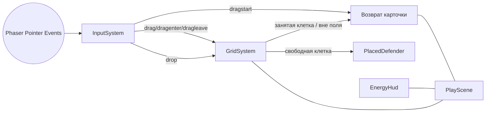

# Технический план: Поле 5×9 и универсальный drag-and-drop

**ID фичи:** 003-grid-and-drag-drop
**Статус:** Approved
**Связанная спека:** [`spec.md`](spec.md)

> Здесь — **как** реализуем требования из `spec.md`. Конкретные файлы, классы, ассеты, ввод.

---

## 1. Технический контекст

- **Фронтенд:** Phaser 3 + TypeScript + Vite (`apps/web`).
- **Бэкенд:** Fastify + TS + Prisma (`apps/api`) — в этой фиче **не меняется**.
- **Shared:** `packages/shared` — в этой фиче **не меняется** (контент-схема защитников появится в Этапе 3).
- **БД:** Postgres — не затрагивается.
- **Контент/ассеты:** статические PNG для поля и одной карты (без JSON-контента и Zod-схем).

Особые зависимости и базовые соглашения этой фичи:

- Используем существующий цикл сцен: `BootScene → PreloadScene → MainMenuScene → … → PlayScene` (новая).
- Ввод **только** через Phaser Pointer Events: `pointerdown`/`pointermove`/`pointerup` и встроенный `this.input.setDraggable(...)` + события `dragstart`/`drag`/`dragenter`/`dragleave`/`drop`/`dragend`. Отдельных веток для мыши/тача быть не должно (Принцип 5).
- Виртуальное разрешение `1280×720` с `Scale.FIT` сохраняется. Grid должен корректно пересчитываться по `scale.on("resize")`, как сделано в `MainMenuScene`.
- Grid 5 строк × 9 столбцов фиксируется как **технический** инвариант (Принцип 12); числа выносятся в `apps/web/src/config/grid.ts`, а не размазываются по сценам.
- Энергия = 50 — визуальная заглушка (UI-only state), без ECS/системы экономики.

## 2. Проверка соответствия Конституции (Constitution Check)

| # | Принцип | Соблюдаем? | Как именно |
|---|---------|------------|------------|
| 1 | Spec-first | Да | `spec.md` создан и одобрен; этот документ — `plan.md` до начала кодинга. |
| 2 | pnpm-монорепо | Да | Изменения только в `apps/web` и `specs/003-grid-and-drag-drop/`; никаких новых пакетов и менеджеров. |
| 3 | Data-driven контент | Да | Защитник «Земля» здесь — UI-карточка-плейсхолдер без статов; настоящий JSON-контент защитников появляется в Этапе 3. Числа геймдизайна не вводятся. |
| 4 | Shared-first типы | Да | Типы `CellAddress`, `CardId` — клиент-only (не пересекают границу клиент↔сервер); если в будущем понадобятся в API, переедут в `packages/shared`. Дублирования между `apps/*` нет. |
| 5 | Universal input | Да | Единственный путь ввода — Phaser Pointer Events / `setDraggable`. Нет ветвлений `isMobile`/`isTouch`. Hitbox карточки и клетки ≥ 64 px. |
| 6 | Deploy-first | Да | Фича исключительно клиентская, проходит обычный `pnpm deploy:prod`; staging-деплой по PR. |
| 7 | Playable demo | Да | Демо описано в `spec.md §7` и в `quickstart.md` — реальное взаимодействие с полем. |
| 8 | Guest-first auth | Да | Сцена `play` доступна без логина, как и весь демо-флоу до Этапа 7. |
| 9 | AI-ассеты в едином стиле | Да | Для `board-bg`, `cell-highlight`, `earth-card`, `earth-idle` ниже зафиксированы единые промпты с базовой формулой Solar Balls. |
| 10 | Testable AC | Да | Каждое FR из `spec.md §3` покрыто как минимум одним AC из `§5`; все AC проверяемы вручную в `quickstart.md`. |
| 11 | One feature = one branch | Да | План рассчитан на отдельную ветку `feature/003-grid-and-drag-drop`. |
| 12 | Константы в конституции, баланс в контенте | Да | Размер поля `5×9` уже зафиксирован в `.specify/memory/constitution.md` как технический инвариант; «энергия 50» в этой спеке — UI-плейсхолдер, явно out of scope как баланс. |

> Нарушений нет. Принцип 3 не активируется в этой спеке намеренно: контент-схема защитников входит в скоуп спеки 004 (Этап 3 мастер-плана). При следующей спеке `EarthCard` и плейсхолдер-спрайт будут заменены на JSON-defender без изменения публичного API сцены `play`.

## 3. Архитектурное решение

Новая сцена `play` собирает три независимых компонента (Grid, Palette, EnergyHud) и подключает к ним общую `InputSystem`. Палитра — **источник** перетаскивания (`dragstart`), Grid — **цель** (`drop`/`dragenter`/`dragleave`). Фабрика-плейсхолдер `PlacedDefender` создаёт спрайт на клетке после удачного дропа.



Ключевые принципы дизайна:

- **GridSystem** — единственный владелец клеток и координатной арифметики «пиксели ↔ (row, col)»; знает только о себе и подсветке.
- **CardPalette** — владеет карточкой(-ами) в палитре, знает, как «отпустить призрак» и как «вернуть карточку домой».
- **InputSystem** — тонкий слой над `this.input.setDraggable`, занимающийся только подпиской/отпиской и проксированием событий. **Никакой** игровой логики в нём; решения «свободна / занята / вне поля» принимает GridSystem.
- **PlayScene** — координатор: создаёт компоненты, подписывает их друг на друга, обрабатывает resize, навигацию «Назад».
- **EnergyHud** — статичный UI-компонент, в этой спеке не подписан ни на какие события; состояние «50» захардкожено как placeholder и проброшено через `apps/web/src/config/grid.ts` (или `play-config.ts`) как `ENERGY_PLACEHOLDER`, чтобы будущая спека легко его заменила реальной системой.

Z-ordering во время перетаскивания:

- `board-bg` — `depth: 0`.
- Сетка и подсветка клетки — `depth: 5`.
- Установленные защитники — `depth: 10`.
- Палитра и карточки в покое — `depth: 20`.
- «Призрак» перетаскиваемой карточки — `depth: 100` (поверх всего, чтобы не перекрывался HUD'ом).
- HUD энергии и кнопка «Назад» — `depth: 200`.

## 4. Затрагиваемые файлы и изменения

### Новые файлы

- `apps/web/src/scenes/play/PlayScene.ts` — основная сцена «ИГРАТЬ»; ключ сцены `"play"`.
- `apps/web/src/systems/GridSystem.ts` — расчёт клеток, подсветка, ответ на запрос «эта точка экрана — какая клетка?», флаги занятости.
- `apps/web/src/systems/InputSystem.ts` — обёртка над `this.input.setDraggable` и событиями drag-цепочки; единая точка регистрации источников и целей.
- `apps/web/src/ui/CardPalette.ts` — палитра слева; владеет карточками и анимацией «возврат домой».
- `apps/web/src/ui/DefenderCard.ts` — UI-примитив карточки защитника (drag-source); параметризуется `cardId` и спрайтом.
- `apps/web/src/ui/PlacedDefender.ts` — спрайт защитника на клетке (drop-result); тонкая обёртка над `Phaser.GameObjects.Image`.
- `apps/web/src/ui/EnergyHud.ts` — счётчик энергии (UI-only, статичное значение 50).
- `apps/web/src/ui/CellHighlight.ts` — переиспользуемый объект подсветки клетки (одна инстанция, переезжает между клетками).
- `apps/web/src/config/play.ts` — константы поля (`GRID_ROWS=5`, `GRID_COLS=9`, `CELL_SIZE_VIRTUAL`, `BOARD_X`, `BOARD_Y`, `MIN_HITBOX_PX=64`, `ENERGY_PLACEHOLDER=50`).
- `apps/web/public/assets/play/board-bg.png` — фон поля (см. §7).
- `apps/web/public/assets/play/cell-highlight.png` — спрайт подсветки клетки.
- `apps/web/public/assets/play/earth-card.png` — карточка «Земля» в палитре.
- `apps/web/public/assets/play/earth-idle.png` — спрайт «Земля» на клетке (плейсхолдер до Этапа 3).
- `apps/web/public/assets/ui/energy-icon.png` — иконка энергии слева от счётчика HUD.

### Изменяемые файлы

- `apps/web/src/main.ts` — регистрация `PlayScene` в массиве `scene`; удаление `PlayStubScene` из активного списка (см. ниже).
- `apps/web/src/scenes/MainMenuScene.ts` — кнопка «ИГРАТЬ» вызывает `this.scene.start("play")` вместо `"play-stub"`.
- `apps/web/src/scenes/PreloadScene.ts` — `this.load.image(...)` для всех новых ключей: `board-bg`, `cell-highlight`, `earth-card`, `earth-idle`, `energy-icon`.
- `apps/web/src/i18n/ru.json` и `apps/web/src/i18n/en.json` — добавить ключи (см. §7).

### Удаляемые / реклассифицируемые файлы

- `apps/web/src/scenes/stubs/PlayStubScene.ts` — удаляется. Из главного меню больше не маршрутизируется (заменён на `PlayScene`). Если позже понадобится стаб — будет восстановлен через `git`. Эту операцию фиксируем в `tasks.md` отдельной задачей, чтобы не «забыть мёртвую» сцену в `main.ts`.

## 5. Data Model

Не применимо. Фича не меняет БД, Prisma-схему и `packages/shared`. Все типы — клиентские:

```ts
// apps/web/src/systems/GridSystem.ts
export type CellAddress = { row: number; col: number };
export type CellState = "empty" | "occupied";
```

Если в будущих спеках возникнет необходимость передавать состояние поля по сети — типы переедут в `packages/shared/src/dto/board.ts` без изменения сигнатуры в клиенте.

## 6. API-контракты

Не применимо. Фича чисто клиентская; новых HTTP-эндпоинтов и DTO нет. Файл `specs/003-grid-and-drag-drop/contracts/` создавать не требуется.

## 7. Контент и ассеты

### i18n-ключи (новые)

`apps/web/src/i18n/ru.json` и `apps/web/src/i18n/en.json` дополняются согласованными парами ключей:

- `play.title` — «Игровое поле» / «Game Board».
- `play.energy` — «Энергия» / «Energy».
- `play.card.earth` — «Земля» / «Earth».

Существующие ключи (`common.back`) переиспользуются. Ключ `stub.playTitle` после удаления `PlayStubScene` остаётся в словарях временно (на случай отката), удаляется в следующей чистке словарей в Этапе 3.

### Ассеты (сначала проверяем `assets/`, недостающее догенерируем)

Все PNG — прозрачный фон (кроме `board-bg`), оптимизация ≤ 200 КБ (Принцип 9).

- `board-bg.png` (1280×720, можно с прозрачным «полем» по центру):
  > `cartoonish neon space play board background, vivid purples cyans magenta, soft glow, faint hex grid, no text, Solar Balls style, 16:9 composition`
- `cell-highlight.png` (160×160, прозрачный, без заливки в центре):
  > `neon cyan magenta rounded square outline, glowing 4px stroke, transparent fill, Solar Balls style, transparent background, 160x160 PNG`
- `earth-card.png` (256×360, прозрачный):
  > `kawaii planet earth card, vivid neon purple cyan magenta frame, rounded card shape, kawaii face on planet, Solar Balls style, transparent background, 256x360 PNG`
- `earth-idle.png` (256×256, прозрачный):
  > `kawaii planet earth defender character, big eyes, neon glow, vivid purples cyans magenta, Solar Balls style, transparent background, 256x256 PNG`
- `energy-icon.png` (64×64, прозрачный):
  > `kawaii glowing energy orb icon, neon cyan magenta gradient, soft halo, Solar Balls style, transparent background, 64x64 PNG`

### Стандартные размеры

- Виртуальная клетка: `CELL_SIZE_VIRTUAL = 96` px при поле 9×96 = 864 px по горизонтали; высота 5×96 = 480 px. Поле помещается в виртуальное окно 1280×720 с запасом сверху на HUD и снизу на «Назад».
- Палитра шириной 280 px фиксирована слева; одна карточка занимает 256×360 с центрированием.
- Минимальный hitbox карточки и клетки ≥ 64 px (NFR-2 из спеки) — обеспечивается размером ≥ 96 px.

## 8. Quickstart (ручная проверка)

Пошаговая инструкция: [`quickstart.md`](quickstart.md).

## 9. Риски и откат

- **Риск.** На iOS Safari (особенно старых версий) браузер может перехватить тач-жест и инициировать прокрутку страницы во время `drag`.
  - **Митигация.** В `BootScene`/`main.ts` гарантируем `touchAction: "none"` на канвасе и `this.input.addPointer(2)`; проверяем сценарий на симуляторе iPhone SE.
- **Риск.** При `Scale.FIT` и ресайзе окна координаты Grid рассинхронизируются с DOM-указателем.
  - **Митигация.** Все позиции пересчитываются в `scale.on("resize")` через единый метод `GridSystem.layout(width, height)`. Тест проверки описан в `quickstart.md`.
- **Риск.** «Призрак» перетаскиваемой карточки перекрывается HUD-ом или палитрой.
  - **Митигация.** Зафиксированный depth-стек (см. §3); юнит-проверка в demo: при перетаскивании поверх HUD-а карточка остаётся видимой.
- **Риск.** Hitbox карточки слишком мал на мобиле.
  - **Митигация.** Минимальный hitbox 64 px вынесен в `play.ts` (`MIN_HITBOX_PX`), используется при создании `setInteractive`-зоны.
- **Риск.** Двойной `drop` (быстрый палец) приводит к двойной установке защитника.
  - **Митигация.** GridSystem помечает клетку `occupied` синхронно в `drop`-обработчике; повторный drop в ту же клетку отвергается.

**План отката.** Один `git revert` коммита фичи возвращает проект к состоянию после спеки 002 без миграций, без влияния на API/БД/содержимое других сцен. `MainMenuScene` восстанавливает маршрут на `play-stub`, файл `PlayStubScene.ts` возвращается из истории.

## 10. Последующие фазы

- `tasks.md` — пошаговый чек-лист реализации (через `/tasks`).
- `data-model.md` — **не требуется** (см. §5).
- `research.md` — **не требуется**: альтернативы (HTML-DnD vs Phaser drag) отвергнуты Принципом 5 на уровне конституции.
- `contracts/` — **не требуется** (см. §6).
- Следующая спека (`004-defender-content-schema`, Этап 3): Zod-схема защитника, `content/defenders/sun.json`, `earth-shooter.json`, `ContentLoader`. Эта спека сознательно подготавливает почву: сцена `play` и `PlacedDefender` будут переключены на JSON-defender без изменения сигнатур UI.
